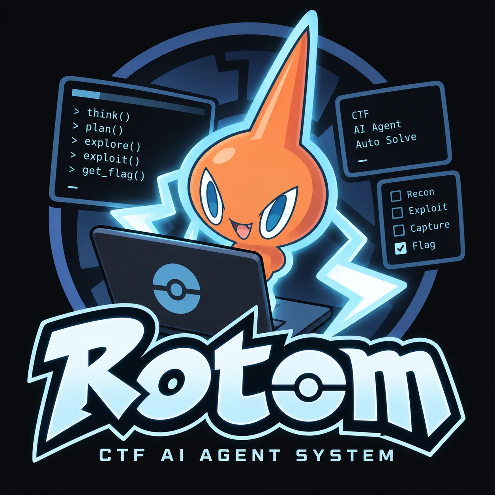
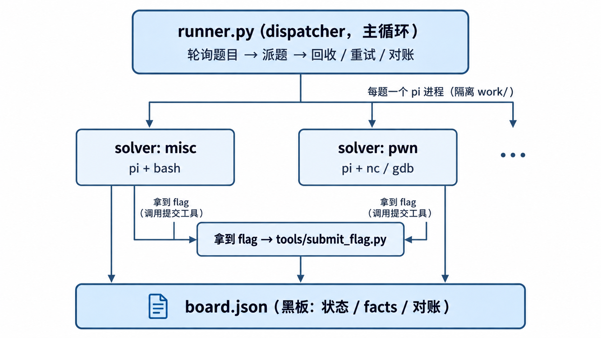

<div align="center">



# Rotom ⚡

**自动化 CTF 答题 Agent —— 潜入哪类题,就长成解决它的形状**

[简体中文](README.md) · [English](README.en.md)

</div>

---

> 「它会用由离子构成的身体潜入各种各样的机器里,最喜欢将其作为躯体。」
> —— [神奇宝贝百科 · 洛托姆](https://wiki.52poke.com/wiki/%E6%B4%9B%E6%89%98%E5%A7%86)

参考 [Cairn](https://github.com/oritera/Cairn) 的黑板架构,为「AI 智能体解题赛」打造的轻量 harness:
**调度层只管派题、并发、重试、对账;每题一个隔离 agent**(`pi` CLI)自带工作区、共享黑板与方向知识库;
提交与审计统一走 harness 工具。模型不绑定——现场在网页控制台填 Base URL + Key 即可切换。

## 战绩

| 场景 | 结果 |
|---|---|
| 正式赛第二轮(10 题) | **10/10,10 分 09 秒**,18 秒第一血,提交全对 |
| 正式赛第三轮(决赛,更难) | 6/10,0 次错误提交 |
| 本地 14 题 × 36 并发 | 14/14,平均 67s,0 次限流 |
| 5 类题全自动验收 | 5/5,约 3 分钟 |
| NSSCTF Agent Arena | 累计 **21/22 = 95.45%** |

## 快速开始

```bash
./start.sh                   # 体检 → 网页控制台 → 后台开跑(崩溃自动重启)
./start.sh --check-only      # 只体检
./start.sh status | stop     # 看状态 / 优雅停机
```

现场三步:控制台填 **token + 模型四项**(Base URL / Key / 模型名 / API 类型)→ 点「测试接口」「测试模型」→ 「开始跑」。
计时从「开始跑」起算(`ROUND_WINDOW_MINUTES`),截止时间持久化:重启不重置,过期自动重新计时。

## 怎么解题

**广度优先**铺满题目 → 同题默认 2 个 agent 靠**共享黑板**协同 → 限流按 20%/步自动降并发 →
单题限时 420→900s 递增、**以时间为界不限次重试**(重试保留现场、自动注入知识库片段)→
解出即提交、继续下一题 → 全解完驻留等新题。
需要更多算力?agent 在黑板写「请求增援」,harness 空闲时加派(每题上限 4)。

## 架构



`contest_api.py` 查题/重置/提交(限流自动退避,区分「答错」与「未受理」) ·
`solver.py` 工作区/附件/prompt/失败分类 · `runner.py` 主循环 · `board.py` 黑板 · `dashboard.py` 网页控制台 ·
`tools/` 提交、重置、知识库检索、看护与复盘。
详细设计(架构图/时序图/状态机):**[docs/ARCHITECTURE.md](docs/ARCHITECTURE.md)**

## 配置

```bash
python3 config.py --token icqXXX \
                  --base-url https://api.xxx/v1 --key sk-XXX \
                  --model deepseek-flash --api-type openai-completions
python3 config.py --test          # 实测连通
```

等价操作全在网页控制台。网络默认直连(`NET_PROXY=direct`),免疫本机失效代理;模型支持 OpenAI 兼容 / Anthropic / Google 四种 API 类型。

## 离线知识库

9000+ 段、检索 0.2s:六方向自写 playbook + PayloadsAllTheThings + ctf-wiki + RsaCtfTool。

```bash
python3 tools/kb.py search "sql 注入 绕过"
```

playbook 注入 prompt、卡住强制查、重试自动投喂——四层保证真的被用上。
第三方资料不入仓库,clone 后跑 `knowledge/fetch_vendor.sh` 一键重建。

## 比赛期运维

`tools/watchdog.py` 自愈看护(控制台/runner 掉了自动重拉、心跳假死杀掉重拉、开赛前探放题) ·
`tools/status_now.py` 一屏状态 · `tools/round_watch.py` 事件哨兵 · `tools/postmortem.py` 赛后复盘(量化"磕磕绊绊",不靠印象)。

## 测试(都不依赖真实平台)

`tests/unit_test.py` **58 项离线断言** · `tests/scale_test.py` 调度回归(24~100 题) ·
`tests/local_contest.sh` 本地端到端 · `tests/load/run_load.sh` 高并发压测。

## 交付与审计

`tools/export_trace.py` 导出 Thought/Action/Observation 轨迹;`tools/package_submission.py` 一键打包部署包(自动脱敏,含合规 README)。

## 使用许可

欢迎 **Fork 与魔改**;**商用请联系作者**:1054544881@qq.com

## 致谢

[Cairn](https://github.com/oritera/Cairn)(架构) · [pi](https://github.com/earendil-works/pi)(运行时) ·
[PayloadsAllTheThings](https://github.com/swisskyrepo/PayloadsAllTheThings) / [ctf-wiki](https://github.com/ctf-wiki/ctf-wiki) / [RsaCtfTool](https://github.com/RsaCtfTool/RsaCtfTool)(知识库)。
Rotom 形象归 Nintendo / Game Freak / The Pokémon Company 所有,本项目与其无隶属关系,仅致敬这只"潜入机器、随宿主变形"的电鬼。
