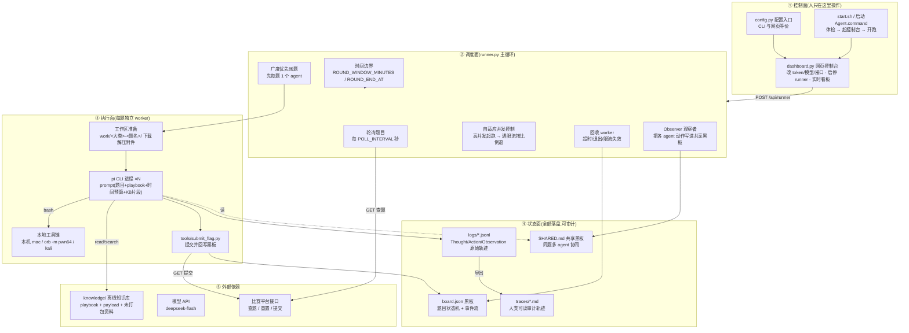
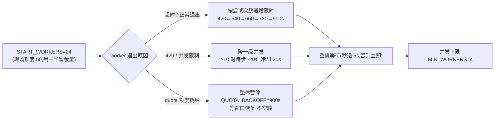

# Rotom 架构与运行逻辑

> 湾区杯 AI 智能体解题赛(环节二/三)自动解题框架。**按一次「开始跑」后全程无人干预**:
> 拉题 → 驱动大模型自主解题 → 校验并提交 flag → 平台对账 → 继续下一题,直到时间窗口结束。

---

## 一、总览(组件分层)



---

## 二、一次运行的生命周期(时序)

```mermaid
sequenceDiagram
    autonumber
    participant U as 你(网页)
    participant D as dashboard.py
    participant R as runner.py
    participant P as 比赛平台
    participant W as pi worker(每题一个进程)
    participant B as board.json / SHARED.md

    U->>D: 填模型+接口 → 保存配置 → 测试模型/接口
    U->>D: 点「开始跑」
    D->>R: 以 ROTOM_RUN_DIR=projects/&lt;项目&gt; 启动 runner(nohup + supervisor)
    R->>R: 解析截止时间(持久化 logs/run_deadline.json)
    loop 主循环(每 3~5 秒)
        R->>P: GET 查题
        P-->>R: 题目列表(is_solved / 附件 / 容器地址)
        R->>B: 同步题目 + 对账(已解出的杀掉 worker)
        R->>R: 广度优先派题(受并发上限约束)
        R->>W: 启动 pi(题目 prompt + 方向 playbook + 时间预算 [+ 重试时 KB 片段])
        W->>W: bash 调工具解题(orb/tshark/pwntools/...)
        W->>B: 每 3~5 步「先读后写」SHARED.md
        W->>P: python3 tools/submit_flag.py &lt;qid&gt; '&lt;flag&gt;'
        P-->>W: CORRECT / WRONG
        W->>B: 正确 → 该题标记 solved
    end
    R->>R: 到点 → 杀所有 worker → 退出
```

---

## 三、单题状态机与重试策略

```mermaid
stateDiagram-v2
    [*] --> pending: 平台下发新题
    pending --> running: 派发(启动即计一次尝试)
    running --> solved: submit_flag 返回 CORRECT<br/>或平台 is_solved=true
    running --> pending: 超时/退出/秒退 → 自动重排<br/>(5 秒或立即,窗口内不限次数)
    running --> pending: 模型限流/额度 → 不消耗重试,退避后重试
    solved --> [*]
    pending --> failed: 仅当设置了次数上限时才会发生
    failed --> pending: FAILED_RETRY_AFTER 秒后复活(兜底)
```



**重试边界是时间,不是次数**:`MAX_ATTEMPTS=0`(不限);从点「开始跑」起算 `ROUND_WINDOW_MINUTES=60`
(或绝对时间 `ROUND_END_AT=14:00`),最后 `STOP_SPAWN_BEFORE_END=120` 秒停止派新题,到点杀全部 worker。
单题限时逐轮递增并封顶:`WORKER_TIMEOUT=420` → `+TIMEOUT_ESCALATE=120` → 最高 `MAX_WORKER_TIMEOUT=900`。

---

## 四、runner 主循环顺序(每轮做的事)

```
                 ┌──────────────────────────────────────────────┐
                 │ 1. reap()              回收结束/超时的 worker │
                 │ 2. kill_submitted_workers() 已解出的立刻停掉  │
                 │ 3. observe_shared()    Observer 写队友动作    │
                 │ 4. revive_failed()     兜底复活(可选)         │
                 │ 5. spawn()             广度优先派题(占位)     │
                 │ 6. launch_prepared()   准备就绪的启动 pi      │
                 │ 7. prune_logs()        日志体积监控(默认不删) │
                 │ 8. write_runner_state() 心跳/并发/剩余时间    │
                 │ 9. print_status()      状态行(带剩余时间)     │
                 │10. sleep(POLL_INTERVAL)                      │
                 │11. reconcile()         查题 + 平台对账        │
                 │12. 到点? → 杀 worker 并退出                   │
                 └──────────────────────────────────────────────┘
```

**广度优先派发**是核心策略:并发 24 时先给 24 道不同的题各 1 个 agent(而不是把 2 个都压在前几道题),
只有题目数少于槽位数时才给同题加派第 2 个 agent —— 保证"多题并行覆盖"而不是"少数题深度优先"。

---

## 五、数据与文件布局

```
projects/<项目>/                  # 默认项目 = 仓库根目录
  board.json                      # 黑板:题目状态机 + 事实流(flock 并发安全)
  logs/runner.out                 # 调度日志
  logs/runner_state.json          # 心跳 / 并发上限 / 剩余时间 / 日志体积
  logs/run_deadline.json          # 本轮截止时间(持久化,重启不重置;过期自动重新计时)
  logs/workers.json               # 在跑的 worker 注册表(看板读取)
  logs/<qid>_w<slot>_<ts>.jsonl   # 每个 agent 的原始轨迹(Thought/Action/Observation)
  logs/submissions.log            # 每次提交的题目/flag/平台返回
  work/<大类>-<题名>/              # 每题一个隔离工作区
      .qid                        # 题目 ID 标记(防同名冲突)
      SHARED.md                   # 同题多 agent 共享黑板(+Observer 提醒)
      files/                      # 附件解压(只读引用)
      w1/ w2/                     # 各 agent 独立 cwd(重试保留产物)
  traces/                         # tools/export_trace.py 导出的人类可读轨迹
```

---

## 六、并发与模型侧限流



---

## 七、同题多 agent 协同(共享黑板)

```
work/web-web01/
  SHARED.md  ← 所有 agent 唯一的沟通渠道(Stigmergy)
     ├─ [w1 计划] 我从 XX 入手          ← agent 自己写
     ├─ [w2 计划] 我走 XX 不同攻击面      ← agent 自己写
     ├─ [Observer 10:03] w1: bash(...)   ← runner 侧 Observer 自动写(兜底)
     ├─ [Observer 10:05] ⚠ w1 已执行 12 步未提交 → 去查知识库
     └─ [w2 结论] 已解出 flag=...         ← 便于队友停止重复劳动
```

- **强制规则**:第一个动作必须读黑板 + 写计划;之后"先读后写"(读得到 Observer 提醒);
  拿到 flag 必须写结论。
- **Observer**:runner 每轮把每个 worker 的最近动作写进黑板 —— 即使模型不写,队友也能看到进展;
  某 agent 满 `KB_NUDGE_STEPS=12` 步未提交,自动写一条"去查知识库"的提醒。

---

## 八、知识库的四层投喂(不依赖模型自觉)

| 层 | 机制 | 何时生效 |
|---|---|---|
| 1 | **方向 playbook 注入 prompt**(约 2.6KB 节选) | 每次派发,常见题不用查就已拥有 |
| 2 | agent 自己 `tools/kb.py search/show/grep` | 遇到陌生题型时(实测靶场 10 个会话查了 18 次) |
| 3 | prompt 强制自救流程 + 黑板提醒 | 连续 8~10 步无进展时 |
| 4 | **重试时 harness 自动检索并注入片段** | 同一题第 2 次尝试起(实测注入约 1.3~1.4KB) |

---

## 九、外部依赖与部署拓扑

```
      ┌─────────────────────────── 你的笔记本(macOS) ───────────────────────────┐
      │                                                                        │
      │  dashboard.py :8799  ──HTTP──►  浏览器(你操作控制台/看看板)              │
      │        │                                                               │
      │        └─ 启动 ─► runner.py ──► pi 进程 ×N ──┬─► bash(本机工具)           │
      │                        │                    │      tshark/sqlmap/python3 │
      │                        │                    └─► orb -m pwn64(amd64 虚拟机)│
      │                        │                          gdb/pwntools/radare2  │
      │                        ├─► 比赛平台 API  *.ichunqiu.com(强制直连)        │
      │                        └─► 模型 API     deepseek-flash                 │
      └────────────────────────────────────────────────────────────────────────┘
```

- **网络**:比赛接口域名**强制直连**(本机代理会破坏其 HTTPS);模型接口按现场网络走(或走代理)。
- **断网演练**:`NETWORK_MODE=local_only` 可把 worker 的出网打到黑洞(只放行目标与模型),用于模拟现场无外网。

---

## 十、交付与审计(比赛规则要求)

```
logs/*.jsonl ──tools/export_trace.py──► traces/<题>_w<槽>.md + SUMMARY.md
                                           (Thought / Action / Observation 三段式)
                └─tools/package_submission.py──► dist/rotom-agent-<项目>-<时间>.tar.gz
                       内含:代码 + 合规 README(环境/配置/日志审计) + 脱敏 .env.example + traces
```

审计语义:一次工具调用 = `tool_execution_start`(Action)+ 紧随的 `toolResult`(Observation);
模型发言 = `message_end` 里的 assistant 文本(Thought)。日志默认**不自动清理**(`MAX_LOG_MB=0`)以保证轨迹完整。

---

## 十一、关键参数速查(当前比赛配置)

| 参数 | 值 | 含义 |
|---|---|---|
| `START_WORKERS` / `MIN_WORKERS` | 24 / 4 | 起始并发(现场额度 50,用一半)与下限 |
| `WORKERS_PER_QUESTION` | 2 | 同题最多 2 个 agent(共享黑板协同) |
| `WORKER_TIMEOUT` / `TIMEOUT_ESCALATE` / `MAX_WORKER_TIMEOUT` | 420 / 120 / 900 | 单题限时及逐轮递增上限(秒) |
| `MAX_ATTEMPTS` | 0 | 0 = 不限次数(以时间为界) |
| `ROUND_WINDOW_MINUTES` / `ROUND_END_AT` | 60 / (空) | 本轮时长,或绝对结束时间(优先) |
| `STOP_SPAWN_BEFORE_END` | 120 | 结束前多少秒停止派新题 |
| `QUICK_RETRY_DELAY` | 5 | 秒退后的重试间隔(要"坏了立刻重试") |
| `POLL_INTERVAL` | 3 | 查题轮询间隔(秒) |
| `QUOTA_BACKOFF` | 900 | 额度耗尽后的暂停时长(秒) |
| `KB_AUTO_SEARCH` / `KB_NUDGE_STEPS` | 1 / 12 | 重试自动注入知识库 / 多少步未提交就提醒 |
| `PI_MODEL` / `PI_API_TYPE` | deepseek-flash / openai-completions | 解题模型与接口类型 |
